# k8s-HA

# Cluster MySQL de Alta Disponibilidade com Kubernetes e Amazon EKS

## Visão Geral

Este projeto apresenta a implementação de um ambiente MySQL em alta disponibilidade sobre Kubernetes, utilizando Amazon EKS, StatefulSet, Headless Service, PersistentVolumeClaims e volumes persistentes provisionados via Amazon EBS.

O objetivo principal foi replicar uma arquitetura de banco de dados stateful em Kubernetes, validando conceitos fundamentais de infraestrutura em nuvem, persistência de dados, comunicação interna entre réplicas, replicação MySQL e tolerância a falhas em um ambiente gerenciado pela AWS.

A implementação também serve como base para estudos futuros envolvendo segurança em ambientes Kubernetes, especialmente com ferramentas de análise como Checkov e Kubescape.

---

## Objetivos do Projeto

Os principais objetivos deste projeto foram:

- Criar um cluster Kubernetes gerenciado com Amazon EKS;
- Implantar um banco de dados MySQL em arquitetura de alta disponibilidade;
- Utilizar StatefulSet para garantir identidade estável aos Pods;
- Configurar persistência de dados com PersistentVolumeClaims e Amazon EBS;
- Validar a comunicação interna entre réplicas por meio de Headless Service e DNS interno;
- Configurar e testar replicação entre instâncias MySQL;
- Avaliar o comportamento do ambiente diante da recriação de Pods;
- Documentar os resultados obtidos como estudo prático de infraestrutura em nuvem.

---

## Tecnologias Utilizadas

- Amazon EKS
- Kubernetes
- Amazon EC2
- Amazon EBS
- EBS CSI Driver
- AWS VPC CNI
- CoreDNS
- MySQL
- kubectl
- eksctl
- YAML
- StatefulSet
- PersistentVolumeClaim
- ConfigMap
- Secret

---

## Arquitetura da Solução

A solução foi construída sobre um cluster Amazon EKS com três nós de trabalho, responsáveis por executar as réplicas do MySQL. Cada réplica foi implantada como um Pod gerenciado por um StatefulSet, garantindo identidade persistente, armazenamento individual e nomes de rede previsíveis.

A comunicação entre os Pods ocorre por meio de um Headless Service, permitindo que cada instância MySQL seja acessada individualmente por DNS interno. A persistência dos dados é realizada por volumes Amazon EBS, provisionados dinamicamente a partir de uma StorageClass customizada.

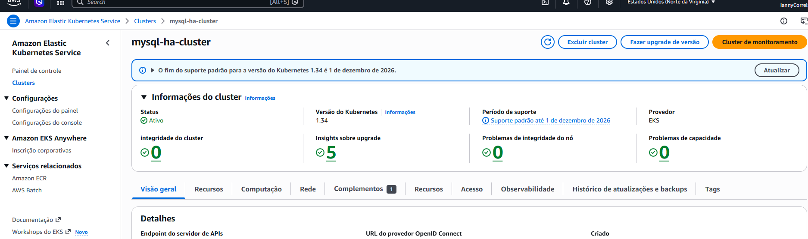

---

## Componentes da Arquitetura

| Componente | Função |
|---|---|
| Amazon EKS | Serviço gerenciado da AWS utilizado para executar o cluster Kubernetes. |
| EC2 Worker Nodes | Instâncias responsáveis por executar os Pods do cluster. |
| StatefulSet | Controlador utilizado para manter identidade estável dos Pods MySQL. |
| Headless Service | Serviço responsável pela descoberta individual das réplicas MySQL. |
| PersistentVolumeClaim | Solicitação de armazenamento persistente para cada réplica. |
| Amazon EBS | Armazenamento persistente utilizado pelos Pods MySQL. |
| EBS CSI Driver | Driver responsável por integrar volumes EBS ao Kubernetes. |
| CoreDNS | Serviço de DNS interno do Kubernetes. |
| ConfigMap | Recurso utilizado para armazenar configurações do MySQL. |
| Secret | Recurso utilizado para armazenar credenciais sensíveis. |

---

## Estrutura do Repositório

```txt
k8s-HA/
│
├── README.md
├── .gitignore
│
├── mysql-configmap.yaml
├── mysql-service.yaml
├── mysql-statefulset.yaml
├── storage.yaml
├── mysql-secret.example.yaml
│
└── docs/
    └── evidencias/
        ├── eks-cluster-overview.png
        ├── system-pods.png
        ├── statefulset-mysql.png
        ├── worker-nodes.png
        ├── endpoints-headless-service.png
        ├── pvc-bound.png
        ├── dns-test.png
        ├── replication-status.png
        └── data-replication-validation.png

```


## Arquivos Kubernetes

| Arquivo | Descrição |
| :--- | :--- |
| `storage.yaml` | Define a `StorageClass` utilizada para provisionamento dos volumes persistentes. |
| `mysql-configmap.yaml` | Define configurações customizadas do MySQL. |
| `mysql-service.yaml` | Define o serviço de rede utilizado pelo MySQL, incluindo o *Headless Service*. |
| `mysql-statefulset.yaml` | Define o `StatefulSet` responsável por executar as réplicas MySQL. |

---

## Cluster Amazon EKS

O ambiente foi implantado em um cluster **Amazon EKS**, utilizando um plano de controle gerenciado pela AWS. Essa abordagem elimina a necessidade de administrar manualmente componentes críticos do Kubernetes, como o *API Server* e o *etcd*.

O cluster foi configurado com **três nós de trabalho**, fornecendo uma base para distribuição das réplicas MySQL em diferentes instâncias EC2.

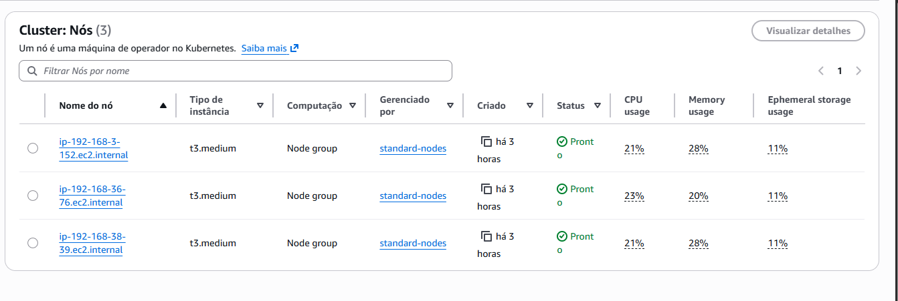

>   *Configuração dos nós do cluster e instâncias EC2 utilizadas.*

### Nós de Trabalho

Foram utilizadas instâncias EC2 do tipo `t3.medium`, cada uma com 2 vCPUs e 4 GiB de memória. O cluster foi configurado com três nós, permitindo distribuir as réplicas do MySQL entre diferentes máquinas virtuais.

Essa configuração contribui para a alta disponibilidade, pois, caso um nó apresente falha, o Kubernetes pode reagendar os Pods em outros nós disponíveis.

### Componentes de Sistema do Kubernetes

Durante a criação do cluster, foram utilizados componentes essenciais do ecossistema Kubernetes e AWS:

* **`aws-node`**: plugin de rede da AWS, responsável pela integração com a VPC;
* **`ebs-csi-node` e `ebs-csi-controller`**: responsáveis pela integração entre Kubernetes e Amazon EBS;
* **`coredns`**: responsável pela resolução de nomes internos no cluster;
* **`kube-proxy`**: responsável por regras de rede e encaminhamento interno.

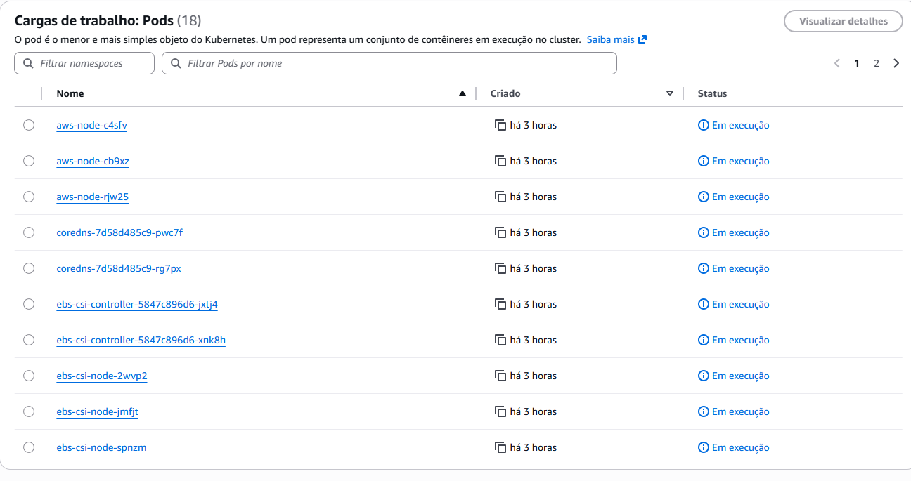

>   *Pods de sistema como aws-node, ebs-csi-node, ebs-csi-controller e coredns em execução.*

---

## StatefulSet do MySQL

O MySQL foi implantado utilizando um `StatefulSet` com três réplicas:

* `mysql-0`
* `mysql-1`
* `mysql-2`

O `StatefulSet` foi escolhido porque bancos de dados são aplicações *stateful*, ou seja, dependem de estado, identidade persistente e armazenamento associado.

Diferente de um `Deployment` (mais adequado para aplicações *stateless*), o `StatefulSet` mantém nomes previsíveis e volumes persistentes associados a cada Pod. Isso garante que, mesmo após uma falha ou recriação, um Pod como o `mysql-1` retorne com a mesma identidade e tente reutilizar seu volume persistente correspondente.

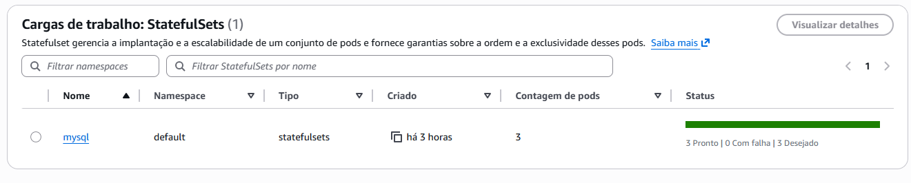

*Visualização do StatefulSet do MySQL e suas respectivas réplicas.*

---

## Persistência de Dados

A persistência foi configurada com `PersistentVolumeClaims` (PVC) vinculados a volumes **Amazon EBS**. Cada réplica do MySQL possui seu próprio volume persistente, evitando perda de dados em caso de reinicialização ou recriação dos Pods.

A `StorageClass` customizada `mysql-storage` foi utilizada para provisionar os volumes necessários no ambiente AWS. Os volumes foram criados com modo de acesso `ReadWriteOnce`, garantindo que cada volume seja montado por apenas um nó por vez, evitando riscos de corrupção por acesso simultâneo indevido.

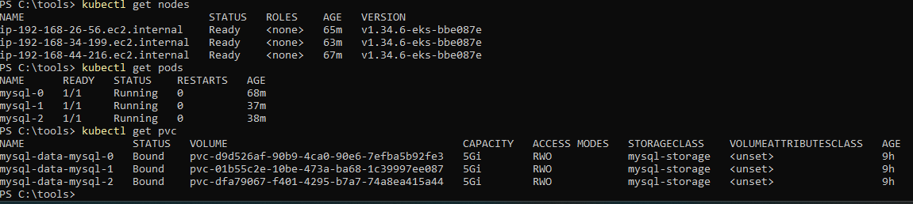

>   *Exibição dos volumes mysql-data-mysql-0, mysql-data-mysql-1 e mysql-data-mysql-2 com status Bound.*

---

## Rede Interna e Service Discovery

A comunicação entre as réplicas MySQL foi realizada por meio de um **Headless Service**. Esse tipo de serviço permite que cada Pod seja resolvido individualmente por DNS interno.

Exemplos de nomes utilizados:

* `mysql-0.mysql`
* `mysql-1.mysql`
* `mysql-2.mysql`

Esse comportamento é essencial em ambientes de banco de dados replicado, pois cada instância precisa identificar corretamente o nó primário e os nós secundários.

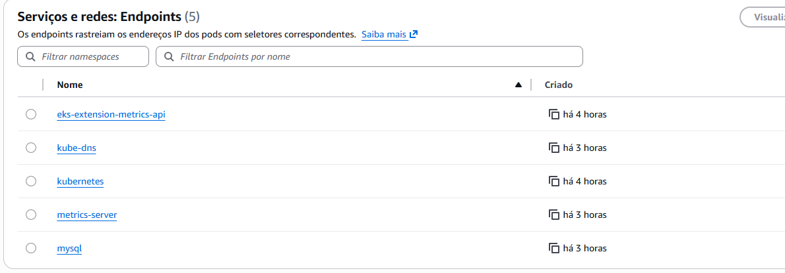


>   *Endpoints e EndpointSlices associados ao serviço mysql.*

### Teste de DNS Interno

A resolução de nomes foi validada com comandos executados dentro dos Pods, confirmando que as réplicas conseguiam resolver os nomes umas das outras.

```bash
kubectl exec -it mysql-0 -- getent hosts mysql-1.mysql
kubectl exec -it mysql-0 -- getent hosts mysql-2.mysql
```
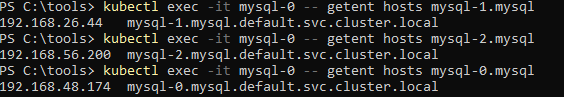

### Instancias EC2
- **Tipo de Instância:** Foram utilizadas instâncias do tipo **t3.medium**. Cada nó possui 2 vCPUs e 4 GiB de memória, configuração ideal para suportar tanto o orquestrador quanto os processos do MySQL.
- **Quantidade de Nós:** O cluster foi configurado com um grupo de nós gerenciados contendo **3 instâncias**, garantindo que as três réplicas do banco de dados (mysql-0, mysql-1 e mysql-2) residam em máquinas físicas/virtuais distintas.

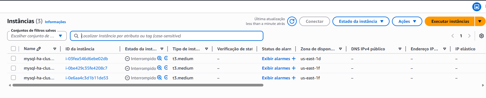

## Validação e Status da Replicação de Dados

Para garantir a confiabilidade da arquitetura de alta disponibilidade, o cluster de banco de dados foi submetido a três etapas de validação técnica: consistência de identidades, integridade das threads de replicação e testes práticos de escrita/leitura.

---

### 1. Identificação Única dos Nós 

O correto funcionamento da topologia Primário/Réplica no MySQL exige que cada instância possua uma identificação exclusiva (`server_id`). Através de um mapeamento dinâmico via ConfigMap/StatefulSet, as identidades foram injetadas de forma isolada e sequencial.

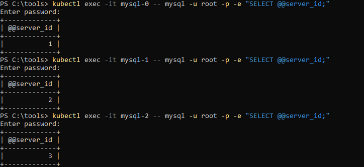

> *Validação das propriedades de identificação em cada Pod do StatefulSet.*

* **Nó Primário (`mysql-0`):** Configurado com `server_id = 1`.
* **Primeira Réplica (`mysql-1`):** Configurado com `server_id = 2`.
* **Segunda Réplica (`mysql-2`):** Configurado com `server_id = 3`.

Esse isolamento impede conflitos no consumo e distribuição dos logs binários do cluster.

---

### 2. Status de Saúde da Replicação 

A saúde do espelhamento de dados foi validada inspecionando o status interno do motor do MySQL em todas as frentes. O nó primário registra as transações ativas, enquanto os nós secundários leem e executam esses logs.

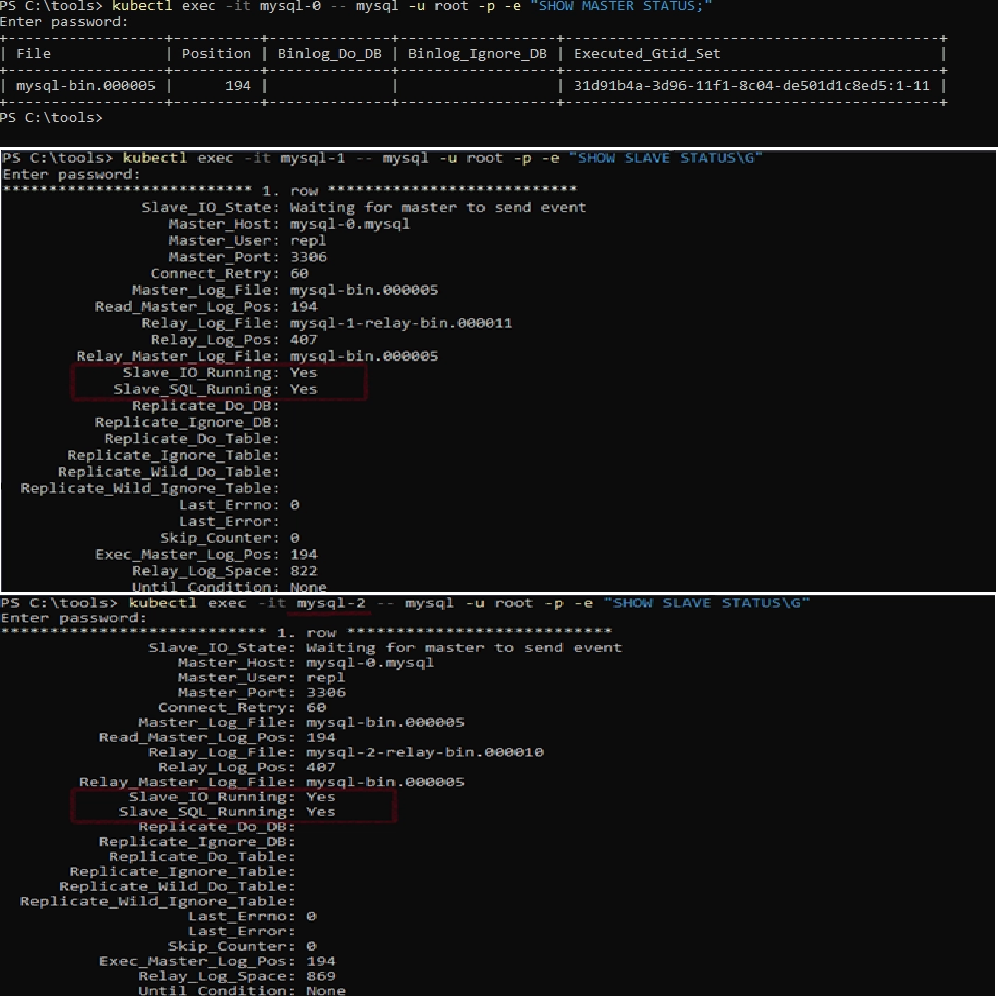

*Saída dos comandos SHOW MASTER STATUS e SHOW SLAVE STATUS demonstrando sincronismo ativo.*

#### Análise Técnica dos Componentes:

* **Nó Primário (`mysql-0`):** O comando `SHOW MASTER STATUS;` indica que o banco está gerando logs ativamente no arquivo binário `mysql-bin.000005`, utilizando controle de transações globais (**GTID**).
* **Nós Secundários (`mysql-1` e `mysql-2`):** Ambas as réplicas apontam corretamente para o host do primário (`mysql-0.mysql`) através do Headless Service na porta `3306`.
* **Canais de Sincronismo Saudáveis:** Ambas as réplicas exibem os dois parâmetros vitais com status positivo:
  * `Slave_IO_Running: Yes` -> O Pod está conectado ao primário e copiando os logs de transação.
  * `Slave_SQL_Running: Yes` -> O Pod está aplicando os logs copiados localmente em seu próprio storage EBS.

---

### 3. Teste Prático de Persistência e Replicação

Este teste teve como objetivo validar, de forma prática, se os dados inseridos na instância primária do MySQL poderiam ser consultados posteriormente em uma réplica, utilizando a comunicação interna entre os Pods no Kubernetes.

A escrita foi realizada no Pod `mysql-0`, enquanto a leitura foi validada no Pod `mysql-2`, sem execução de comandos de escrita diretamente na réplica.

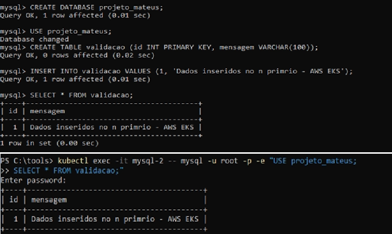

> *Validação prática da replicação: inserção de dados no Pod `mysql-0` e consulta do registro replicado no Pod `mysql-2`.*

#### Fluxo de Execução do Teste

1. **Escrita no nó primário (`mysql-0`)**

   No Pod `mysql-0`, foram executadas operações de criação de banco, criação de tabela e inserção de dados:

   ```sql
   CREATE DATABASE projetoK8s_HA;

   USE projetoK8s_HA;

   CREATE TABLE validacao (
       id INT PRIMARY KEY,
       mensagem VARCHAR(100)
   );

   INSERT INTO validacao VALUES 
   (1, 'Dados inseridos no primario - AWS EKS');
2. **Leitura no nó secundário (mysql-2)**
   No Pod mysql-2, foi executada apenas uma consulta de leitura para verificar se o registro inserido no nó primário havia sido replicado:
```sql
USE projetoK8s_HA;

SELECT * FROM validacao;
```
O registro inserido anteriormente no Pod mysql-0 foi retornado na consulta realizada pelo Pod mysql-2, indicando que a replicação entre as instâncias estava funcionando no cenário testado.

#### Resultado Observado

O teste demonstrou que os dados gravados na instância primária foram propagados para a réplica consultada. Isso confirma que a comunicação entre os Pods MySQL e o fluxo de replicação estavam operacionais durante a execução do experimento.

#### Conclusão do Teste

A exibição do registro no Pod mysql-2 confirma que a replicação MySQL estava funcional no ambiente testado, permitindo que dados inseridos no Pod primário fossem consultados em uma réplica.

Entretanto, como a replicação MySQL utilizada nesse tipo de cenário geralmente ocorre de forma assíncrona, este teste não garante ausência total de perda de dados em caso de falha abrupta do nó primário antes da sincronização completa com as réplicas.

Portanto, o resultado valida o funcionamento da replicação no cenário observado, mas não substitui testes adicionais de failover, consistência, backup e recuperação para uso em ambientes de produção.

## Demonstração em Vídeo

Além das evidências em imagem, foi produzido um vídeo demonstrando a execução prática do ambiente, incluindo a exclusão/recriação de Pod e a validação do comportamento do StatefulSet.

[Assistir demonstração do teste](https://youtu.be/71WfeD1dJKw)
